### Aloha all! 🤙🏽

- https://www.linkedin.com/in/sorianog/
- https://g.dev/sorianog

 

<!--
  
-->

<!--
New way:
https://github.com/marketplace/actions/github-readme-stats-action

-->

<!--
**sorianog/sorianog** is a ✨ _special_ ✨ repository because its `README.md` (this file) appears on your GitHub profile.

Here are some ideas to get you started:

- 🔭 I’m currently working on ...
- 🌱 I’m currently learning ...
- 👯 I’m looking to collaborate on ...
- 🤔 I’m looking for help with ...
- 💬 Ask me about ...
- 📫 How to reach me: ...
- 😄 Pronouns: ...
- ⚡ Fun fact: ...
-->
